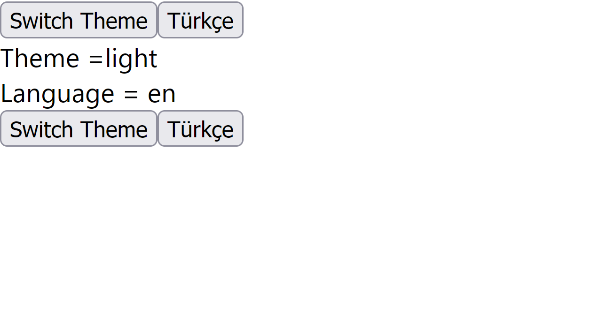
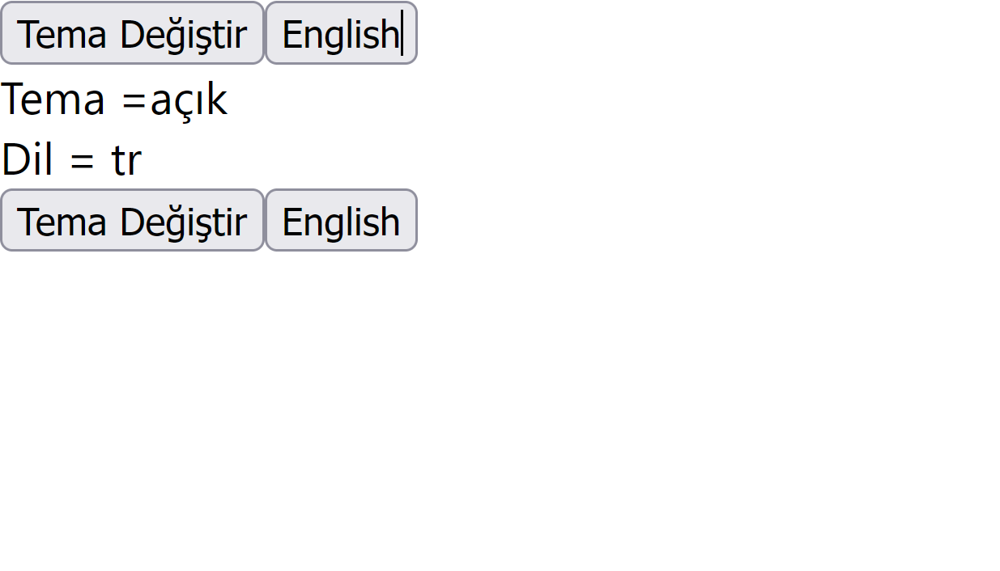

# React Context Çalışma Notu

React Context'i basit bir örnek üzerinden daha iyi anlamaya çalışalım:

Sitemizde dil seçeneği ve tema seçeneği olduğunu düşünelim ve bu seçenekler birer state'te tutuluyor olsun amacımız ise Header ve Footer Component'lari üzerinden tema ve dil state'lerini değiştiren bir uygulama yazmak ve bu aşamada react context'i kullanmak.

Basitçe Uygulama Görünümü:

| Görsel 1                             | Görsel 2                             |
|:-------------------------------------|:-------------------------------------|
|  |  |

### React Context Kullanmadan Yazalım ve Farkı Görelim

**App.js:**
```jsx
import Header from "./components/Header";
import Footer from "./components/Footer";
import {useState} from "react";

function App() {
    const [theme, setTheme] = useState('light')
    const [language, setLanguage] = useState('en')

    return (
        <>
            {/*👇 Header component'i 4 adet prop aldı */}
            <Header theme={theme} setTheme={setTheme} language={language} setLanguage={setLanguage} />
            <main>
                {language === 'en' ? 'Theme' : 'Tema'} =
                {
                    language === 'tr'
                        ? theme === 'light'
                            ? 'açık'
                            : 'koyu'
                        : theme
                }
                <br/>
                {language === 'en' ? 'Language' : 'Dil'} = {language}

            </main>
            {/*👇 Footer component'i 4 adet prop aldı */}
            <Footer theme={theme} setTheme={setTheme} language={language} setLanguage={setLanguage} />
        </>
    );
}

export default App;
```
**Header.jsx:**
```jsx
import React from 'react';
import SwitchTheme from "./SwitchTheme";
import SwitchLanguage from "./SwitchLanguage";

export default function Header({ theme, setTheme ,language, setLanguage }) {
    return (
        <header>
            {/*👇 SwitchTheme component'i 3 adet prop aldı */}
            <SwitchTheme theme={theme} setTheme={setTheme} language={language}/>
            {/*👇 SwitchLanguage component'i 2 adet prop aldı */}
            <SwitchLanguage language={language} setLanguage={setLanguage} />
        </header>
    )
}
```

**Footer.jsx:**
```jsx
import React from 'react';
import SwitchTheme from "./SwitchTheme";
import SwitchLanguage from "./SwitchLanguage";

export default function Footer({ theme, setTheme, language, setLanguage }) {
    return (
        <footer>
            {/*👇 SwitchTheme component'i 3 adet prop aldı */}
            <SwitchTheme theme={theme} setTheme={setTheme} language={language}/>
            {/*👇 SwitchLanguage component'i 2 adet prop aldı */}
            <SwitchLanguage language={language} setLanguage={setLanguage} />
        </footer>
    )
}
```

**SwitchTheme.jsx:**
```jsx
import React from 'react';

export default function SwitchTheme({theme, setTheme, language}) {
    return (
        <>
            <button onClick={() => setTheme(theme === 'light' ? 'dark' : 'light')}>
                {
                    language === 'tr' ? 'Tema Değiştir' : 'Switch Theme'
                }
            </button>
        </>
    )
}
```

**SwitchLanguage.jsx:**
```jsx
import React from 'react';

export default function SwitchLanguage({ language, setLanguage }) {
    return (
        <>
            <button onClick={() => setLanguage(language === 'en' ? 'tr' : 'en')}>
                {language === 'tr' ? 'English' : 'Türkçe'}
            </button>
        </>
    )
}
```

Component'lar arası 2 adet state 18 prop ile ancak aktarılabildi.

### Gelin React Context Kullanalım ve Prop Karmaşasından Kurtulalım 

#### Adım 1: src/context/SiteContext.js isimli bir dosya açıyorum ve bir context üretiyorum.

**SiteContext.js:**
```jsx
import {createContext} from "react";

const context = createContext()

export default context
```

#### Adım 2: App.js'i aşağıdaki gibi refactor ediyorum ve context'i kullanıyorum.
```jsx
import Header from "./components/Header"
import Footer from "./components/Footer"
import {useState} from "react"
// 👇 SiteContext'i dahil ettim
import SiteContext from "./context/SiteContext"

function App() {
    const [theme, setTheme] = useState('light')
    const [language, setLanguage] = useState('en')

    // 👇 states isimli bir obje oluşturdum içine tüm state'lerini aktardım.
    const states = {
        theme,
        setTheme,
        language,
        setLanguage
    }

    return (
        // 👇 SiteContext.Provider component'ının child component'larının
        // 👇 hepsi value içine verdiğim proplara sahip oluyor. (states objesi)
        <SiteContext.Provider value={states}>
            {/*👇 4 adet prop silindi ✅*/}
            <Header /> 
            <main>
                {language === 'en' ? 'Theme' : 'Tema'} =
                {
                    language === 'tr'
                        ? theme === 'light'
                            ? 'açık'
                            : 'koyu'
                        : theme
                }
                <br/>
                {language === 'en' ? 'Language' : 'Dil'} = {language}
            </main>
            {/*👇 4 adet prop silindi ✅*/}
            <Footer />
        </SiteContext.Provider>
    )
}

export default App
```

#### Adım 3: Header ve Footer'daki gereksiz prop kullanımlarından kurtuluyorum.

**Header.jsx:**
```jsx
import React from 'react'
import SwitchTheme from "./SwitchTheme"
import SwitchLanguage from "./SwitchLanguage"

export default function Header() {
    return (
        <header>
            {/*👇 3 adet prop silindi ✅*/}
            <SwitchTheme />
            {/*👇 2 adet prop silindi ✅*/}
            <SwitchLanguage />
        </header>
    )
}
```

**Footer.jsx:**
```jsx
import React from 'react'
import SwitchTheme from "./SwitchTheme"
import SwitchLanguage from "./SwitchLanguage"

export default function Footer() {
    return (
        <footer>
            {/*👇 3 adet prop silindi ✅*/}
            <SwitchTheme />
            {/*👇 2 adet prop silindi ✅*/}
            <SwitchLanguage />
        </footer>
    )
}
```

#### Adım 4: Context'i kullanıyorum.

**SwitchTheme.jsx:**
```jsx
import React, {useContext} from 'react'
// 👇 SiteContext'i Dahil ediyorum
import SiteContext from "../context/SiteContext"

export default function SwitchTheme() {
    // 👇 useContext() fonksiyonunu kullanarak SiteContext'ten ihtiyacım olan stateleri destructing ederek alıyorum.
    const { theme, setTheme, language } = useContext(SiteContext)

    return (
        <>
            <button onClick={() => setTheme(theme === 'light' ? 'dark' : 'light')}>
                {
                    language === 'tr' ? 'Tema Değiştir' : 'Switch Theme'
                }
            </button>
        </>
    )
}
```

**SwitchLanguage.jsx:**
```jsx
import React, {useContext} from 'react'
// 👇 SiteContext'i Dahil ediyorum
import SiteContext from "../context/SiteContext"

export default function SwitchLanguage() {
    // 👇 useContext() fonksiyonunu kullanarak SiteContext'ten ihtiyacım olan stateleri destructing ederek alıyorum.
    const { language, setLanguage } = useContext(SiteContext)

    return (
        <>
            <button onClick={() => setLanguage(language === 'en' ? 'tr' : 'en')}>
                {language === 'tr' ? 'English' : 'Türkçe'}
            </button>
        </>
    )
}
```

18 prop'un 18'inden de kurtulduk ve prop karmaşıklığından kodu arındırdık. ✅